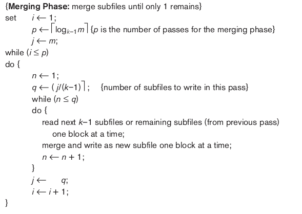

# Project Phase 2

### Team : Systumm Faad Denge

| Name | Roll No.  | Contribution |
| --- | --- | --- |
| Nachiket Patil | 2020101018 | External Sorting, JOIN, Report |
| Abhishek Sharma | 2020101050 | External Sorting, Order By, Report |
| Ayan Agarwal | 2020101034 | External Sorting, Group By, Report |

### External Sorting

External sorting refers to sorting algorithms that are suitable for large files of record stored on disk that do not fit entirely in main memory, such as most data-base files. The typical sorting algorithm uses a ************sort-merge strategy************ , which starts by sorting small subfiles. The algorithm requires a **************************buffer space************************** in main memory, where the actual sorting and merging of the chunks is performed. 

In the **sorting** phase, runs of the file that can fit in available buffer space are read into main memory, sorted using an internal sorting algorithm ( quick sort) and written back to disk as temporary sorted subfiles. 


In **********************merging********************** phase , the sorted runs are merged during one or more merge passes. Each merge pass can have one or more steps. The ************************************degree of merging************************************  is the number of sorted subfiles that can be merged in each merge step. 



```latex
**SORT <table_name> BY <column_name1, column_name2,..., column_namek> IN
<ASC|DESC, ASC|DESC,..., ASC|DESC>**
```

### Implementation

`SortComparator` **Class**

This class defines a comparison function that is used for sorting rows based on specific columns. It is a templated class and is intended to be used with different data types. Here are its key components:

- **`sortColumnIndices`**: A vector that stores the indices of the columns based on which sorting is to be performed.
- **`sortStrategies`**: A vector of sorting strategies for each of the specified columns (ASC or DESC).
- **`compareColumnCount`**: The number of columns to be used for comparison.

The **`SortComparator`** class provides an overloaded function operator **`()`** that compares two rows based on the specified columns and sorting strategies.

### **`HeapComparator` Class**

This class is derived from the **`SortComparator`** class and is specialized for use in the merging phase of the external sorting algorithm. It is templated, similar to the **`SortComparator`** class, but has some differences:

- It handles a tuple containing rows of data, page indices, and page pointers.
- The comparison function in this class operates on these tuples.

### **`Table` Class**

The **`Table`** class represents a table of data to be sorted. It contains various functions and data members that are relevant to the sorting process:

- **`externalSort`**: The main function for initiating the external sorting process. It takes sorting column names and sorting strategies as input parameters.
- **`executeSORT_sortingPhase`**: Performs the sorting phase of external sorting. It reads data from the table, sorts it, and writes sorted chunks to disk.
- **`executeSORT_mergingPhase`**: Performs the merging phase of external sorting. It reads and merges the sorted chunks from the previous phase, creating larger sorted chunks.

### **`executeSORT_sortingPhase` Function**

The **`executeSORT_sortingPhase`** function is responsible for the sorting phase of external sorting. This phase is designed to sort chunks of data from the table and write them to disk in sorted order. Here's a more detailed explanation:

1. **Reading Data Chunks**: It iterates through the data in blocks or chunks. Each block is loaded into memory, and the rows within the block are read sequentially. The data is read using the cursor.
2. **Sorting**: The rows within each chunk are sorted using the **`SortComparator`** class. The **`sort`** function from the C++ Standard Library is typically used for this purpose. This sorting is based on the specified columns and sorting strategies (ascending or descending).
3. **Buffering and Writing Sorted Chunks**: The sorted rows are then buffered. When the buffer reaches a certain size or is full, the data is written to disk. This process continues for all the data chunks, creating sorted temporary files on disk.
4. **Updating Block Count and Rows Per Block Count**: The **`blockCount`** and **`rowsPerBlockCount`** are updated to reflect the sorted blocks' count and the number of rows in each block.
5. **Cleanup**: Once all data chunks have been sorted and written, the function concludes the sorting phase.

### **`executeSORT_mergingPhase` Function**

The **`executeSORT_mergingPhase`** function handles the merging phase of external sorting. In this phase, the sorted data chunks generated in the sorting phase are merged to create larger sorted chunks. Here's a more detailed explanation:

1. **Merging Multiple Chunks**: It iterates through the sorted chunks created in the sorting phase. For each chunk, a cursor is created to read data from that chunk. Data from all the chunks is read and placed into a priority queue (heap). The priority queue ensures that the smallest (or largest, based on sorting strategy) element is always on top.
2. **Merging Sorted Rows**: The function dequeues rows from the priority queue and adds them to the merged rows buffer. When this buffer is full or reaches a certain size, the merged data is written to disk as a new sorted block.
3. **Block Count and Rows Per Block Count**: The **`blockCount`** and **`rowsPerBlockCount`** variables are updated to reflect the count of the merged blocks and the number of rows in each block.
4. **Repetition**: The merging process is repeated iteratively until the entire dataset is sorted. The number of repetitions depends on the number of chunks generated during the sorting phase.
5. **Cleanup**: After merging all chunks, the function completes the merging phase.


## Applications of External Sorting

### 1. JOIN

```latex
**<new_relation_name> <- JOIN <tablename1>, <tablename2> ON <column1>
<bin_op> <column2>**
```

The command consists of `tablename1` and `tablename2` , on which JOIN operation has to be applies with respect to given `column1` and `column2` with the given binary operation `<bin_op>` .

Steps:

1. First both the tables are sorted (ASC) w.r.t  to given columns using `OrderBy` .
2. All the columns (attributed) are to be included in the resultant table columns, and then we use table cursor functionality to iterate over the rows. 
3. The code iterates through rows in two tables (**`table1`** and **`table2`**) using nested loops.
4. It compares rows based on a specified condition (**`comp`**), checking values in specific columns.
5. Matching rows are copied to a result container (**`resultantRows`**), combining data from both tables.
6. When the result container reaches its maximum size, the result table (**`resultantTable`**) is updated with the joined rows.
7. The process continues until all rows have been compared and joined.


### 2. Order By

```latex
**<new_table> <- ORDER BY <attribute> ASC|DESC ON <table_name>**
```

This is similar to the SORT command, the only difference is the number of column attribute is considered to be one here. So we can directly apply External Sort with sorting attribute and its sorting strategy. 

```cpp
const vector<string> sortColumnNames ({parsedQuery.orderByColumnName});
const vector<SortingStrategy> sortingStrategies ({parsedQuery.orderBySortingStrategy});
resultantTable->externalSort(sortColumnNames, sortingStrategies);
```

### 3. Group By

```latex
**<new_table> <- GROUP BY <grouping_attribute> FROM <table_name> HAVING
<aggregate(attribute)> <bin_op> <attribute_value> RETURN
<aggregate_func(attribute)>**
```

The command consists of four terms : 

1. `<grouping_attribute>` is the column in the table based on which table has to be
sorted. 
2. `<attribute>` column which is used to test(Compare) with column values. 
3. `<bin_op>` is the comparison operator mentioned above. 
4. `<aggregate_func(attribute)>` are MIN,MAX,SUM,COUNT,AVG

**Steps:** 

1. **********************************Sorting:********************************** The table is subjected to external sorting using the specified `<grouping_attribute>` in ASC (sorting strategy) order. The sorting groups identical values together efficiently.
2. ****************************************************Grouping and Aggregation:**************************************************** A new resultant table is formed to store the grouped and aggregated result. In this step, the function iterates through the sorted data rows using the cursor. For each row: 
    - It checks if a new grouping key is encountered. If so, it finalizes the aggregation for the previous grouping key.
    - If the grouping key remains the same, the aggregation is updated based on the aggregate operation specified (**`parsedQuery.groupByAggregateOperator`**).
    - The function also checks the HAVING condition, which is specified by **`parsedQuery.groupByHavingBinaryOperator`** and **`parsedQuery.groupByHavingValue`**. If the HAVING condition is met, the result is added to the **`resultantRows`** buffer.
    - The number of rows per grouping key is counted.
    

### Learnings

- Understood the working of external merge sort algorithm in detail
- Learnt how to implement the external sorting efficiently using less number of file accesses and improved time complexity using priority queue while doing k-way merging.
- Learnt how to deal with file pointers while merging.
- Use of comparator in priority queue and sorting.
- Applied the sorting algorithm to implement the JOIN, ORDER BY and GROUP BY efficiently